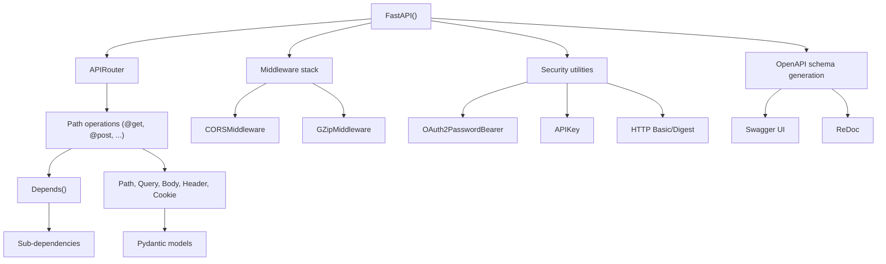

# FastAPI

**What:** Modern Python web framework for building APIs with automatic OpenAPI documentation. Built on Starlette + Pydantic.
**Repo:** `repos/fastapi` | https://github.com/fastapi/fastapi
**License:** MIT
**Python:** >=3.10 | **Core deps:** starlette>=0.46.0, pydantic>=2.9.0

## Architecture

## Package Structure (`fastapi/`)

| Module | Purpose |
|--------|---------|
| `applications.py` | FastAPI app class |
| `routing.py` | APIRouter, path operation routing |
| `params.py` | Path, Query, Body, Header, Cookie, Form, File, Depends |
| `param_functions.py` | Parameter convenience functions |
| `requests.py` | Request object |
| `responses.py` | Response classes (JSON, HTML, Streaming, File, etc.) |
| `exception_handlers.py` | Built-in exception handlers |
| `exceptions.py` | HTTPException, RequestValidationError |
| `dependencies/` | Dependency injection system |
| `middleware/` | CORS, GZip, HTTPS redirect, trusted host, WSGI |
| `security/` | API key, HTTP auth, OAuth2, OpenID Connect |
| `openapi/` | OpenAPI schema generation, docs, models |
| `background.py` | Background tasks |
| `testclient.py` | TestClient |
| `websockets.py` | WebSocket support |
| `sse.py` | Server-Sent Events |
| `encoders.py` | JSON encoder (datetime, etc.) |
| `datastructures.py` | UploadFile, Cookie, DefaultPlaceholder |
| `cli.py` | `fastapi` CLI command |
| `concurrency.py` | Async/sync bridge utilities |
| `templating.py` | Jinja2Templates |
| `staticfiles.py` | StaticFiles |
| `logger.py` | Logger instance |
| `types.py` | Type definitions |
| `utils.py` | Utility functions |

## Documentation (12 languages)

Primary English docs at `docs/en/docs/` with 12 translations (de, es, fr, ja, ko, pt, ru, tr, uk, zh, zh-hant).

## See Also

- [lode-map.md](lode-map.md)