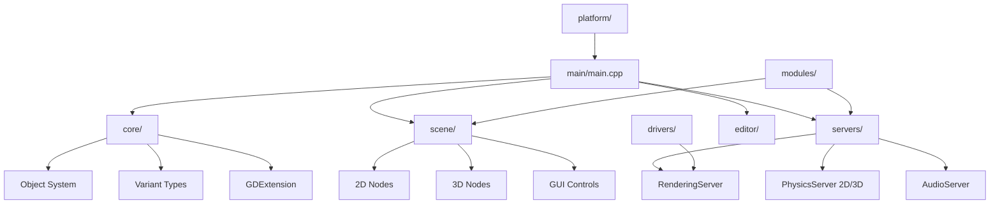

# Godot Engine Source

**Version:** 4.7.0-beta (from `version.py`)
**Repository Root:** `repos/godot`
**Stats:** ~7599 C/C++/ObjC++ source, ~131 Python build scripts, ~152 GLSL shaders, ~810 XML doc class files

## Architecture Overview

## See Also

- [lode-map.md](lode-map.md)
