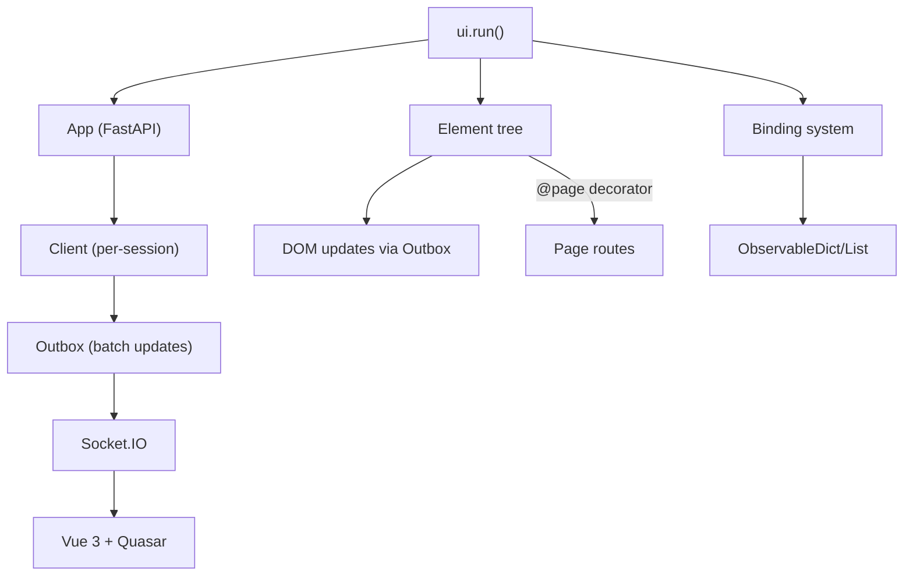

# NiceGUI

**What:** Python-based UI framework that renders in a browser (or native desktop via pywebview). Backend-first: all UI logic in Python, frontend is Vue 3 + Quasar.
**Repo:** `repos/nicegui` | https://github.com/zauberzeug/nicegui
**License:** MIT
**Stack:** Python + FastAPI backend; Vue 3 + Quasar + Socket.IO frontend; uvicorn single-worker async

## Architecture



## Key Concepts

- **Element**: Base class inheriting from `Visibility`. Has `component`, `props`, `classes`, `style`, `text`, `visible`. All UI elements inherit from `Element` + mixins.
- **Page**: `@ui.page` decorator creates routes. Each browser session gets a `Client` with isolated state.
- **Binding**: `bind()`, `bind_from()`, `bind_to()` connect element properties bidirectionally. `ObservableDict`/`ObservableList` for reactive data.
- **Outbox**: Accumulates DOM mutations, sends batches over Socket.IO. Avoids per-update round trips.
- **Storage**: `app.storage.browser` (per-tab), `app.storage.general` (cross-session), `app.storage.secret` (server-side encrypted).

## Element Hierarchy

```
Visibility
  └── Element — root of all UI elements
        ├── ContentElement — innerHTML (Markdown, Code, reStructuredText)
        ├── TextElement — text property (Label)
        ├── ValueElement — value + on_change (Input, Checkbox, Select, etc.)
        │     └── ValidationElement — form validation rules
        ├── DisableableElement — enabled/disabled (Button, Select, etc.)
        ├── SelectableElement — selected state
        ├── SourceElement — source URL/file (Image, Audio, Video)
        ├── NameElement — name property for forms
        ├── LabelElement — label property
        ├── IconElement — icon property
        ├── FilterElement — filter property
        ├── SortableElement — drag-and-drop sortable
        └── ChoiceElement — choice/selection binding
```

## UI Elements (90+)

| Category | Elements |
|----------|----------|
| **Text/Content** | label, markdown, restructured_text, code, html |
| **Input** | input, textarea, number, color_input, date, date_input, time, time_input, slider, range, knob, rating, select, radio, toggle, checkbox, switch, input_chips |
| **Buttons/Actions** | button, button_dropdown, button_group, fab |
| **Layout** | card, column, row, grid, separator, space, scroll_area, splitter, expansion, drawer, header, footer, page_sticky, page_scroller, teleport |
| **Navigation** | link, tabs, stepper, step, stepper_navigation, pagination, menu, sub_pages |
| **Data Display** | table, aggrid, tree, log, timeline, carousel, carousel_slide, badge, chip, avatar, progress, spinner, skeleton, interactive_image, query |
| **Charts/Viz** | pyplot, echart, plotly, highchart, altair, line_plot, mermaid |
| **3D/Maps** | scene (Three.js), leaflet (maps) |
| **Editors** | editor (WYSIWYG), codemirror, json_editor |
| **Media** | image, audio, video, icon, parallax |
| **Feedback** | dialog, notification, tooltip, context_menu, dark_mode, fullscreen, keyboard |
| **File/Upload** | upload_files, download |
| **Drag/Swap** | sortable, slide_item |
| **Special** | anywidget (Jupyter), joystick, xterm (terminal), keep_alive, colors |

## UI Functions (not elements)

clipboard, download, add_body_html, add_head_html, run_javascript, navigate, notify, on, on_exception, page_title, refreshable, add_css, add_sass, add_scss, status_code, update, timer

## See Also

- [lode-map.md](lode-map.md)