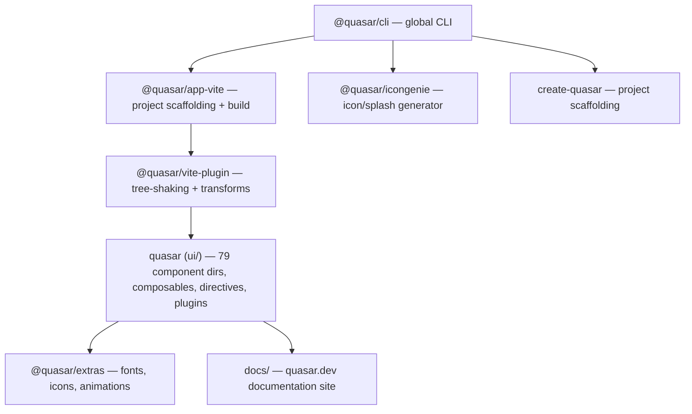

# Quasar Framework

**What:** Vue.js framework for building responsive SPA, SSR, PWA, mobile, desktop, and browser extension apps from a single codebase.
**Repo:** `repos/quasar` | https://github.com/quasarframework/quasar
**License:** MIT
**Versions:** quasar v2.19.3, @quasar/app-vite v3.0.0-beta.8, @quasar/cli v4.0.0, @quasar/extras v1.18.0, @quasar/vite-plugin v1.11.0, @quasar/icongenie v4.0.0, create-quasar v2.2.3
**Stack:** Vue 3 + Vite/Rolldown, pnpm monorepo, 130+ Material Design components, 50+ i18n language packs

## Architecture

## Monorepo Packages

| Path | Package | Purpose |
|------|---------|---------|
| `ui/` | `quasar` | Core UI framework: components, composables, directives, plugins, utils |
| `app-vite/` | `@quasar/app-vite` | Quasar project CLI & build system (Vite) |
| `vite-plugin/` | `@quasar/vite-plugin` | Vite plugin for tree-shaking Quasar imports |
| `cli/` | `@quasar/cli` | Global CLI (create, dev, build, serve, info) |
| `extras/` | `@quasar/extras` | Fonts, icon sets, animation CSS |
| `create-quasar/` | `create-quasar` | `npm create quasar` scaffolding |
| `icongenie/` | `@quasar/icongenie` | App icon & splash screen generator |
| `docs/` | `quasar.dev` (private) | Documentation website |

## Deployment Modes

SPA, SSR, PWA, BEX (Browser Extension), Capacitor (Mobile), Cordova (Mobile), Electron (Desktop)

## See Also

- [lode-map.md](lode-map.md)